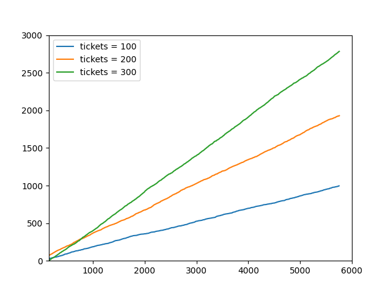

### implement pstat.h

```c
#ifndef _PSTAT_H_
#define _PSTAT_H_

#include "param.h"

struct pstat {
  int inuse[NPROC];   // whether this slot of the process table is in use (1 or 0)
  int tickets[NPROC]; // the number of tickets this process has
  int pid[NPROC];     // the PID of each process 
  int ticks[NPROC];   // the number of ticks each process has accumulated 
};

#endif // _PSTAT_H_
```

### Edit proc struct in proc.h

add the fields of pstat to the proc struct

```c
int inuse;
int tickets;
int ticks;
```

## Implement settickets system call

### add to syscall.c

```c
extern int sys_settickets(void);
//add to (*syscalls[])(void)
[SYS_settickets] sys_settickets,
```

### add to syscall.h

```c
#define SYS_settickets 23
```

### add to user.h

```c
int settickets(int);
```

### add to usys.S

```c
SYSCALL(settickets)
```

### add to sysproc.c

```c
int
sys_settickets(void)
{
    int n;
    if(argint(0, &n) < 0)
        return -1;
    if(n < 0)
        return -1;
    myproc()->tickets = n;
    return 0;
}
```

## Implement getpinfo system call

### add to syscall.c

```c
extern int sys_getpinfo(void);
//add to (*syscalls[])(void)
[SYS_getpinfo] sys_getpinfo,
```

### add to syscall.h

```c
#define SYS_getpinfo 24
```

### add to user.h

```c
#include "pstat.h"
int getpinfo(struct pstat *ps);
```

### add to usys.S

```c
SYSCALL(getpinfo)
```

### add to sysproc.c

```c
int sys_getpinfo(void){
   struct pstat *ps;
   if(argint(0,  (int*)(&ps)) < 0)
       return -1;
   getpstat(ps);
 return 0;
}
```

### add to proc.c

```c
void
getpstat(struct pstat* ps){
    struct proc *p;
   acquire(&ptable.lock);
   int i = 0;
  for(p = ptable.proc; p< &ptable.proc[NPROC]; p++, i++){
      if(p->state == UNUSED)
          continue;
      ps->inuse[i] = 1;
      ps->pid[i] = p->pid;
      ps->ticks[i] = p->ticks;
      ps->tickets[i] = p->tickets;
   }
  release(&ptable.lock);
 }
```

### add to defs.h

```c
struct pstat;
void getpstat(struct pstat *ps);
```

## Change the default Scheduler

### edit proc.c

#### to the top of the file

```c
int seed = 1234;
```

#### allocproc function

```c
static struct proc*
allocproc(void)
{
  struct proc *p;
  char *sp;

  acquire(&ptable.lock);

  for(p = ptable.proc; p < &ptable.proc[NPROC]; p++)
    if(p->state == UNUSED)
      goto found;

  release(&ptable.lock);
  return 0;

found:
  p->state = EMBRYO;
  p->pid = nextpid++;
  p->tickets = 1;
  p->inuse = 1;
  release(&ptable.lock);

  // Allocate kernel stack.
  if((p->kstack = kalloc()) == 0){
    p->state = UNUSED;
    return 0;
  }
  sp = p->kstack + KSTACKSIZE;

  // Leave room for trap frame.
  sp -= sizeof *p->tf;
  p->tf = (struct trapframe*)sp;

  // Set up new context to start executing at forkret,
  // which returns to trapret.
  sp -= 4;
  *(uint*)sp = (uint)trapret;

  sp -= sizeof *p->context;
  p->context = (struct context*)sp;
  memset(p->context, 0, sizeof *p->context);
  p->context->eip = (uint)forkret;

  return p;
}
```

#### wait function

```c
int
wait(void)
{
  struct proc *p;
  int havekids, pid;
  struct proc *curproc = myproc();

  acquire(&ptable.lock);
  for(;;){
    // Scan through table looking for exited children.
    havekids = 0;
    for(p = ptable.proc; p < &ptable.proc[NPROC]; p++){
      if(p->parent != curproc)
        continue;
      havekids = 1;
      if(p->state == ZOMBIE){
        // Found one.
        pid = p->pid;
        kfree(p->kstack);
        p->kstack = 0;
        freevm(p->pgdir);
        p->pid = 0;
        p->parent = 0;
        p->name[0] = 0;
        p->killed = 0;
        p->state = UNUSED;
        p->tickets = 0;
        p->ticks = 0;
        p->inuse = 0;
        release(&ptable.lock);
        return pid;
      }
    }
```

#### scheduler function

```c
void
scheduler(void)
{
  struct proc *p;
  struct cpu *c = mycpu();
  c->proc = 0;
  for(;;){
    // Enable interrupts on this processor.
    sti();

    // Loop over process table looking for process to run.
    acquire(&ptable.lock);
    int count = 0;
    for(p = ptable.proc; p < &ptable.proc[NPROC]; p++){
         if(p->state != RUNNABLE)
             continue;
         count += p->tickets;
    }
    seed = (8121 * seed + 28411) % 134456;
    int r = 0;
    if(count != 0)
         r = seed % (count + 1);
    count = 0;
    for(p = ptable.proc; p < &ptable.proc[NPROC]; p++){
      if(p->state != RUNNABLE)
        continue;
      count += p->tickets;
      if(count >= r){   
      // Switch to chosen process.  It is the process's job
      // to release ptable.lock and then reacquire it
      // before jumping back to us.
      c->proc = p;
      switchuvm(p);
      p->state = RUNNING;
      p->ticks++;
      swtch(&(c->scheduler), p->context);
      switchkvm();

      // Process is done running for now.
      // It should have changed its p->state before coming back.
      c->proc = 0;
      break;
      }
    }   
    release(&ptable.lock);
  }
}
```

## Graph

the number of time slices a set of three processes receives over time, where the processes have a 3:2:1


